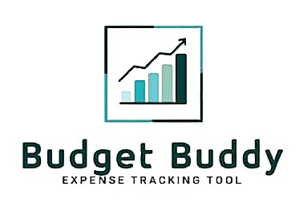

# 💸 Budget Buddy - Expense Tracking Tool



**Budget Buddy** is a user-friendly, secure, and interactive web application designed to help individuals track their daily expenses and manage personal transactions with others. Built using **Python** and **Streamlit**, it features authentication, dynamic visualizations, and CSV export functionalities to make budgeting smarter and simpler.

---

## 👨‍💻 Project Members

- Priyanshu  
- [Teammate Name] *(replace with actual name)*

---

## 🚀 Features

✅ **User Authentication**  
✅ **Expense Logging and Categorization**  
✅ **Transaction Management (Gave/Received)**  
✅ **Data Visualizations (Bar, Line, Pie Charts)**  
✅ **Balance Summary with People**  
✅ **Search, Delete, and Export Options**  
✅ **Responsive UI with Custom Styling**

---

## 🛠️ Technologies Used

- **Frontend/UI**: [Streamlit](https://streamlit.io/)  
- **Database**: SQLite  
- **Languages**: Python  
- **Libraries**:  
  - `pandas`  
  - `matplotlib`  
  - `seaborn`  
  - `bcrypt`  
  - `sqlite3`  
  - `re`  
  - `datetime`

---

## 📸 Screenshots

> 📍 Dashboard, Login, Expense Visuals, and Transaction History included with a custom logo.

---

## 🔧 Setup Instructions

1. **Clone the Repository**

   ```bash
   git clone https://github.com/yourusername/budget-buddy.git
   cd budget-buddy
   ```

2. **Install Dependencies**

   ```bash
   pip install streamlit pandas matplotlib seaborn bcrypt
   ```

3. **Add Logo Image**

   Make sure the image file `pic.jpg` is in the same directory as `project.py`.

4. **Run the App**

   ```bash
   streamlit run project.py
   ```

---

## 🔐 Security Features

- Secure password hashing using `bcrypt`.
- Email format validation and error handling.
- User-specific data storage and retrieval.

---

## 📁 File Structure

```
📦budget-buddy
 ┣ 📄project.py        # Main Streamlit app
 ┣ 📄pic.jpg           # Logo image
 ┗ 📄budgetbuddy.db    # Auto-generated database (created on first run)
```

---

## 📌 Future Improvements

- Add monthly/weekly budgeting goals.
- Enable data sync via cloud/database.
- Add mobile responsiveness.
- Generate spending reports.

---

## 🧠 Inspiration

This project was developed as a collaborative effort between two students to simplify expense tracking using modern Python tools. Inspired by the need for intuitive, visual, and secure financial tools tailored to students and individuals.

---

## 📝 License

This project is open-source and available under the [MIT License](https://opensource.org/licenses/MIT).
